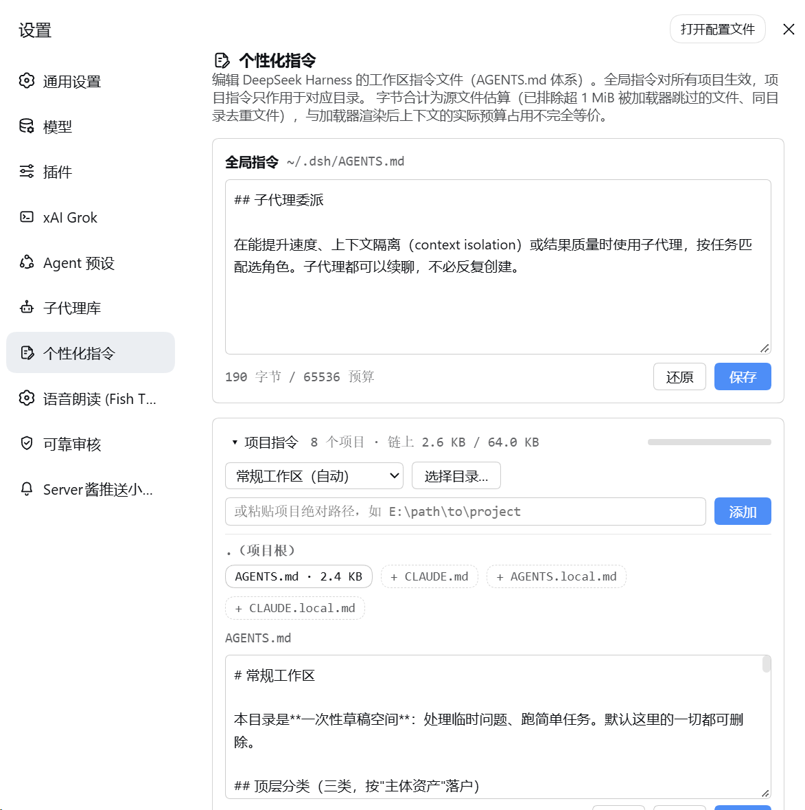

# dsh-agent-instructions-editor

**[中文](./README.md) | English**

<p align="center">
  
</p>

<p align="center">
  
  
  
</p>

A [DeepSeek Harness](https://github.com/deepseek-ai/deepseek-harness) plugin that adds a
Personalization settings page (个性化指令) to the Web GUI for editing the harness workspace
instruction files, in the spirit of Codex's personalization settings:

- the user-global `~/.dsh/AGENTS.md`,
- project-chain `AGENTS.md` / `CLAUDE.md` files discovered with the same rules the
  harness instruction loader applies, and
- `AGENTS.local.md` / `CLAUDE.local.md` overlays.

## Features

- **Global instructions**: a persistent editor for `~/.dsh/AGENTS.md` with a byte-budget
  display (default 65,536).
- **Project instructions** (collapsed by default): a project picker (auto-discovered from
  the workspace registry + recent session directories; manual paths accepted too) that
  renders each level of the "project root → working directory" chain with its 4 candidate
  slots (AGENTS.md / CLAUDE.md / AGENTS.local.md / CLAUDE.local.md) — click to edit an
  existing file or create a missing one.
- **Same discovery rules as the instruction loader**: chain discovery, per-directory
  content dedup (⧉ badge), byte totals and the budget bar follow the same rules as
  `@deepseek-ai/dsh-agent-instructions`.
- **Guarded writes**: filename whitelist + realpath project-root containment + mtime
  conflict detection (409 → reload or force-overwrite) + temp-file atomic rename; writes
  to the same file within one dsh web process are serialized through a queue; a normal
  save using an outdated modification time receives a 409 conflict response.
- **When changes apply**: start a new session after saving. The editor does not directly
  replace instructions in an existing session; reloading is controlled by the host loader.

## Screenshot



View and edit global and project instructions on the same settings page. The current
UI is in Chinese, as shown here.

## Install

Install from npm with the DSH CLI that matches your installed host (recommended):

```sh
dsh plugin --profile web add dsh-agent-instructions-editor@latest
```

Then **restart dsh web** (stop the current process, then run `dsh web`) and refresh the
page. If installing from npm is not an option, install from a fixed GitHub tag instead:

```sh
dsh plugin --profile web add github:MaRi23333/dsh-agent-instructions-editor#v0.1.2
```

Both methods take effect after restarting dsh web.

**Switching from a local directory or GitHub install to npm**: use the command above
with `@latest` to explicitly request the npm version. Keep that suffix so an existing
installation is not mistaken for an already-satisfied request. Restart dsh web afterwards.

Requirements: Node.js 22+, pnpm, and a DSH CLI matching the installed host. No local
build is needed — the npm package and the GitHub repository both ship the `lib/` build
artifacts.

## Security model and known limitations

- Every route validates that the Host header is a loopback literal (`127.x.x.x`,
  `localhost`, `[::1]` — any port), closing off DNS rebinding; POST additionally
  requires a JSON content-type and a strict same-origin Origin (local script clients
  without an Origin header are unaffected).
- Write path: filename whitelist (4 candidates) + directory realpath must fall inside a
  registered project's "project root → working directory" ancestor chain + mtime
  conflict fence (409) + atomic temp-file rename. Writes to the same target within one
  process are serialized through an in-memory queue and the mtime fence is re-checked
  inside it; there is no cross-process file lock — when an external editor or another
  process saves the same file concurrently, a tiny race window remains between the
  fence re-check and the rename, where an external update could in theory be silently
  lost (same as ordinary editors). A malicious local process runs at the same trust
  level as this user (it could edit the files directly) and is not within the threat
  model.
- Reads follow symlinks (same exposure as the official loader); writes replace the
  symlink itself via rename and never write through to the target.
- The editor works with the loader defaults preset by the deployment (markers=`[.git]`,
  4 candidates, 65,536-byte budget); if you change dsh-base's agent-instructions
  configuration, the editor's display drifts accordingly.
- UI copy is currently hardcoded Chinese (a locale dictionary is registered for future
  `t()` integration).

## Architecture

- **Host half** (`src/index.ts`): its own HTTP routes `/agent-instructions/api/{projects,chain,file}`
  (the standard `api.settings.*` wire is allow-listed and unavailable to third-party
  namespaces); the manual-project registry lives in the `agent-instructions-editor`
  settings namespace.
- **Client half** (`src/client/`): contributes the settings page via the
  `settings.section` slot; plain textarea editor (zero extra dependencies).
- **Discovery** (`src/chain.ts`): reimplements the instruction loader's rules one by one
  (marker walk-up, ancestor chain, candidate probing, per-directory sha1(trim) dedup) —
  pure Node, unit-testable.

## Development

```sh
pnpm install
pnpm run typecheck
pnpm run test      # discovery, write-path and edit-state unit tests
pnpm run build     # tsdown: lib/index.js (host) + lib/client.js (browser)
pnpm run smoke     # smoke-host.mjs + smoke-client.mjs
pnpm run check:pack
```

- Dev dependencies are pinned to DSH `0.1.2-rc.1`. The exhaustive exact-version overrides
  in `pnpm-workspace.yaml` exist because:
  1. pnpm 11.21.0 mis-expands caret ranges with prerelease lower bounds
     (`^0.1.2-rc.1` → `>=0.1.2 <0.2.0-0`, which excludes 0.1.2-rc.1 itself), causing
     NO_MATCHING_VERSION; and
  2. `@deepseek-ai/dsh-client-runtime` / `@deepseek-ai/dsh-host-apiproxy` stopped being
     published at `0.1.1-rc.2` (inlined into the CLI from 0.1.2 on).
- These dependencies are used for typechecking and tests only; none of it ships in the
  published artifact (see [THIRD_PARTY_NOTICES.md](./THIRD_PARTY_NOTICES.md)).

## License

[MIT](./LICENSE). The published artifact bundles no third-party code — see
[THIRD_PARTY_NOTICES.md](./THIRD_PARTY_NOTICES.md).

This plugin is an independent community project, not affiliated with or endorsed by
DeepSeek; the `DeepSeek Harness` name is used solely to indicate platform compatibility.
