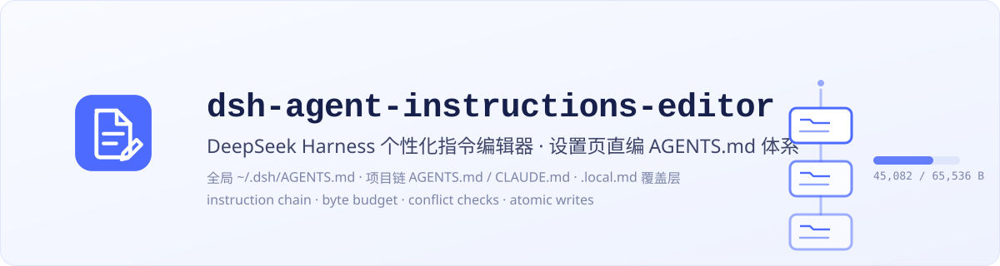

# dsh-agent-instructions-editor

**中文 | [English](./README.en.md)**

<p align="center">
  
</p>

<p align="center">
  
  
  
</p>

> **English:** dsh-agent-instructions-editor adds a 个性化指令 (Personalization)
> settings page to the [DeepSeek Harness](https://github.com/deepseek-ai/deepseek-harness)
> Web GUI for editing the harness workspace instruction files — the user-global
> `~/.dsh/AGENTS.md`, project-chain `AGENTS.md`/`CLAUDE.md` files, and
> `AGENTS.local.md`/`CLAUDE.local.md` overlays — in the spirit of Codex's
> personalization settings. See [README.en.md](./README.en.md) for the full English version.

## 简介

DeepSeek Harness 的个性化指令编辑插件：在 Web 设置页里直接编辑指令文件体系（对标 Codex 的「个性化」设置），由全局编辑器 + 项目链浏览器 + 覆盖层组成，带字节预算显示与「新会话生效」提示。

- **全局指令**：常驻编辑器，读写 `~/.dsh/AGENTS.md`，显示字节预算（默认 65,536）。
- **项目指令**（默认折叠）：项目选择器（自动发现：工作区注册表 + 最近会话目录；也可手动粘贴路径）→ 按「项目根 → 工作目录」逐层展示每层的 4 个候选槽位（AGENTS.md / CLAUDE.md / AGENTS.local.md / CLAUDE.local.md），存在即可点击编辑，不存在可新建。
- **加载器一致的行为展示**：项目链发现、按目录内容去重（⧉ 徽标）、字节合计与预算条，全部镜像 `@deepseek-ai/dsh-agent-instructions` 的真实规则。
- **安全的写入**：文件名白名单 + realpath 项目根包含校验 + mtime 冲突检测（409 → 重新加载或覆盖）+ 临时文件原子替换。
- **如实提示**：指令加载器没有文件监视器——保存后新会话保证生效，已开启的会话在下一次成功文件操作后自动同步。

## 安装

当前为私有测试阶段，尚未发布到 npm。请使用有仓库访问权限的 GitHub 账号下载安装：

1. 登录 GitHub，打开 [MaRi23333/dsh-agent-instructions-editor](https://github.com/MaRi23333/dsh-agent-instructions-editor)，选择 **Code → Download ZIP**，解压到本机目录；也可在 GitHub CLI 登录有权限的账号后运行 `gh repo clone MaRi23333/dsh-agent-instructions-editor`。
2. 将下面的路径替换为解压或 clone 后的插件目录绝对路径（包含 `package.json` 和 `lib/`），保留引号后运行：

```sh
npx @deepseek-ai/dsh plugin --profile web add "file:/absolute/path/to/dsh-agent-instructions-editor" --ignore-scripts
```

3. **重启 dsh web**（停止当前进程，再运行 `dsh web`）并刷新页面。

Windows 示例路径为 `"file:C:/Plugins/dsh-agent-instructions-editor-main"`。请保留 `file:` 前缀，让安装器一并安装运行依赖；使用普通目录路径会按本地开发链接处理。需要 Node.js 22+、pnpm 和与当前宿主匹配的 DSH CLI。

仓库已包含 `lib/` 构建产物，安装使用无需运行开发依赖安装或开发构建；`--ignore-scripts` 使用已有产物。

后续 npm 发布后再提供包名安装方式。

## 安全模型与已知限制

- 所有路由校验 Host 头必须为 loopback 字面量（`127.x.x.x` / `localhost` / `[::1]`，任意端口）——封死 DNS rebinding；POST 额外要求 JSON content-type 与严格同源 Origin（无 Origin 的本机脚本客户端不受影响）。
- 写路径：文件名白名单（4 个候选）+ 目录 realpath 必须落在已注册项目的「项目根→工作目录」祖先链内 + mtime 冲突栅栏（409）+ 临时文件原子替换。本机恶意进程与本用户同信任级别（可直接改磁盘文件），不在防御边界内。
- 指令文件本身是 symlink 时读取会跟随目标（与官方加载器同暴露面）；写入通过 rename 替换 symlink 本身，不会写穿目标。
- 极端并发下 stat→rename 之间存在微秒级窗口，理论上可能静默丢失一次更新（无文件锁，与常规编辑器一致）。
- 编辑器按部署预置的加载器默认值工作（markers=`[.git]`、候选 4 件套、预算 65,536）；若用户修改 dsh-base 的 agent-instructions 配置（自定义 markers/候选/预算），编辑器展示会随之漂移。
- UI 文案当前为硬编码中文（locale 字典已注册，供后续接入 `t()`）。

## 架构

- **Host 半区**（`src/index.ts`）：自有 HTTP 路由 `/agent-instructions/api/{projects,chain,file}`（标准 `api.settings.*` wire 是白名单制，第三方命名空间不可用）；手动项目注册表存放在 `agent-instructions-editor` 设置命名空间。
- **Client 半区**（`src/client/`）：`settings.section` 槽位贡献设置页；纯 textarea 编辑器（零额外依赖）。
- **发现逻辑**（`src/chain.ts`）：逐条镜像指令加载器（marker 上溯、祖先链、候选探测、目录内 sha1(trim) 去重），纯 Node 可单测。

## 开发

```sh
pnpm install
pnpm run typecheck
pnpm run test      # tsx --test tests/chain.test.ts（发现逻辑单测）
pnpm run build     # tsdown：lib/index.js（host）+ lib/client.js（browser）
pnpm run smoke     # smoke-host.mjs + smoke-client.mjs
pnpm run check:pack
```

- 开发依赖锁定 DSH `0.1.2-rc.1`（与本机运行主机一致）。`pnpm-workspace.yaml` 的 overrides 出于两个原因全量精确钉版：
  1. pnpm 11.21.0 会把 `^0.1.2-rc.1` 这类带预发布下界的 caret 范围错误展开为 `>=0.1.2 <0.2.0-0`（排除了 0.1.2-rc.1 自身），导致 NO_MATCHING_VERSION；
  2. `@deepseek-ai/dsh-client-runtime` / `@deepseek-ai/dsh-host-apiproxy` 自 0.1.2 起被内联重构、停止单独发版，钉在最后的 `0.1.1-rc.2`。
- 这些依赖仅用于类型检查与测试，不进入发布产物（见 [THIRD_PARTY_NOTICES.md](./THIRD_PARTY_NOTICES.md)）。

## License

[MIT](./LICENSE)。本发布产物不内联任何第三方代码，说明见 [THIRD_PARTY_NOTICES.md](./THIRD_PARTY_NOTICES.md)。

本插件是独立社区项目，与 DeepSeek 无任何隶属或背书关系；`DeepSeek Harness` 名称仅用于标明兼容平台。
